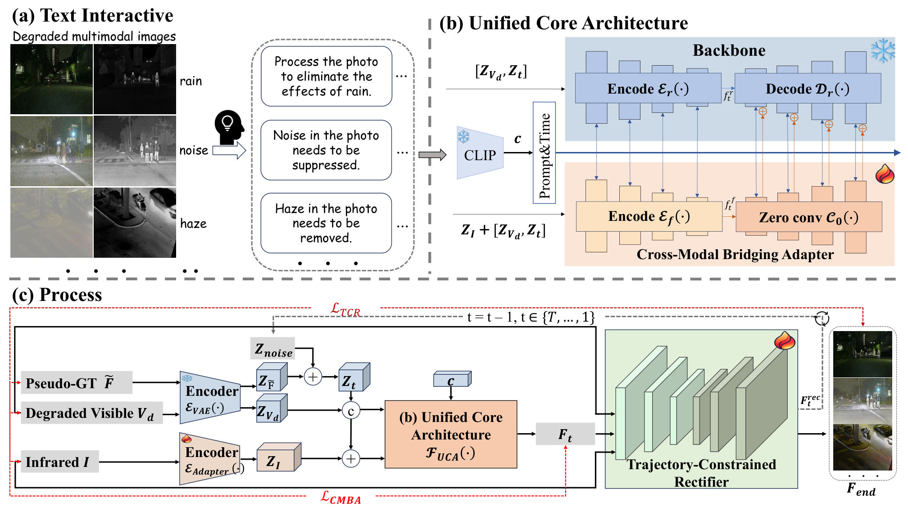

# AIR-Fusion

## 交互式一体化图像恢复与融合 · IJCAI 2026

**论文标题：** Interactive All-in-One Image Restoration and Fusion  
**作者：** Bing Cao、**Qiang Zhang**†、Xingxin Xu、Pengfei Zhu  
† 学生第一作者；作者顺序与正式论文一致。

[项目页](https://qiangzhang-dev.github.io/air-fusion/) · [论文页面](https://www.ijcai.org/proceedings/2026/105) · [论文 PDF](https://www.ijcai.org/proceedings/2026/0105.pdf) · [English](README.md) · [个人主页](https://qiangzhang-dev.github.io/)

> 当前仓库提供论文介绍与引用信息。实现代码、模型权重、环境配置和可运行示例尚未上传。

## 解决什么问题？

红外图像可以突出热目标，可见光图像包含纹理与颜色。但现实中的可见光图像常常受到雨、雾、低照度、噪声或模糊影响：直接融合可能把退化一起带入结果。

AIR-Fusion 探索如何利用预训练扩散模型的恢复能力，在文本指令引导下，同时完成图像恢复与红外–可见光融合。

## 核心思路

1. **保留已有恢复能力。** 冻结具备图像恢复能力的潜空间扩散模型主干。
2. **接入多模态条件。** 通过跨模态桥接适配器 CMBA，将红外信息与文本指令对齐到主干的条件空间。
3. **约束生成过程。** 通过轨迹约束校正器 TCR，在像素与潜空间之间形成闭环，利用源图像结构约束采样并恢复细节。

**图 2：AIR-Fusion 整体框架。** 原图提取自[正式论文第 3 页](https://www.ijcai.org/proceedings/2026/0105.pdf#page=3)，包含文本交互、统一核心架构，以及图像恢复与融合流程。点击图片可查看高清原图。

定量结果、对比设置和局限请以正式论文为准。

## 实现状态

目前没有可执行代码或复现结果。后续安装、推理、训练和评测说明将与真实实现一起整理；当前不提供占位运行命令。

## 引用与联系

引用格式见 [英文 README](README.md#citation)，也可以使用 GitHub 的 “Cite this repository” 入口引用论文。

维护者：**Qiang (Nate) Zhang**  
联系邮箱：[zhangqiang_c@outlook.com](mailto:zhangqiang_c@outlook.com)
